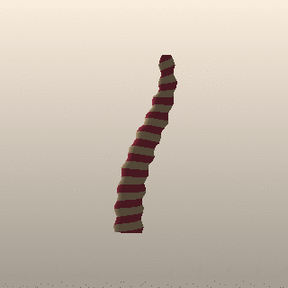

<p align="center"></p>

# OpenGr2ndma

An open-source runtime for Granny 3D `.gr2` files, written as a drop-in replacement
for the parts of the Granny 2.11 C API that older game clients use. It was split out
of the [Metin2 Android port](https://github.com/cemreefe/metin2-android), where it
loads and animates every character, monster, weapon and building model.

Code that does `#include <granny.h>` and calls `GrannyReadEntireFileFromMemory`,
`GrannyInstantiateModel`, `GrannyPlayControlledAnimation`, `GrannyDeformVertices`
and so on can link against this library instead of the proprietary SDK.

<p align="center"></p>

The worm above is `examples/yarn_worm.gr2`: a 6-bone skeleton, a skinned
629-vertex mesh and a 2 s looping animation. OpenGr2ndma loads it, samples the
animation, skins the mesh on the CPU, and `gr2render` rasterises each frame in
software. See [Example](#example).

## What it does

- Reads `.gr2` files in format versions 6 and 7: little-endian 32-bit and 64-bit,
  uncompressed or Oodle-compressed sections, with pointer fixups.
- Converts files into the standard in-memory structures (`granny_file_info`,
  `granny_model`, `granny_mesh`, `granny_skeleton`, `granny_animation`, ...),
  using each file's own embedded type definitions, so files exported by different
  tool versions with extra or missing fields still load.
- Type reflection: `GrannyGetTotalTypeSize`, `GrannyConvertSingleObject`,
  `GrannyFindMatchingMember` (used for `ExtendedData` lookups).
- Meshes: vertex/index access, triangle groups, conversion to any vertex layout.
- Skinning: mesh bindings and a CPU mesh deformer for position + normal.
- Skeletons and animation: model instances, local/world/composite poses,
  controlled animations with looping, speed, clock control and ease in/out.
  Old-style (knot/control) curves are evaluated.

Not implemented: writing `.gr2` files, big-endian files, Bitknit compression,
the newer compressed curve formats (`granny_curve_data_d3_k16...` etc.),
morph targets, texture decoding, and the rest of the SDK (exporters, IK,
animation blending trees, memory/file callbacks). Functions outside the subset
in `include/granny.h` are not provided.

## Build

```sh
cmake -S . -B build -DCMAKE_BUILD_TYPE=Release
cmake --build build
ctest --test-dir build
```

This builds the static library `opengr2ndma`, the `gr2info` tool and the
asset-free API tests. To also check a folder of real `.gr2` files:

```sh
cmake -S . -B build -DOPENGR2NDMA_SAMPLE_DIR=/path/to/assets
ctest --test-dir build
```

To use it from another CMake project:

```cmake
add_subdirectory(third_party/OpenGr2ndma)
target_link_libraries(mygame PRIVATE OpenGr2ndma::opengr2ndma)
```

It is plain C++11 with no dependencies and no platform code. It has been built
with the Android NDK (arm64-v8a, x86_64) and GCC on Linux.

## gr2info

```sh
build/gr2info model.gr2          # summary of skeletons, meshes, animations
build/gr2info --check assets/    # load every .gr2 below a folder
```

## Example

`examples/make_yarn_worm.py` writes `examples/yarn_worm.gr2` from scratch (no
third-party art, so it can be redistributed freely). It lays the file out the way
exporters do: uncompressed little-endian 32-bit sections, embedded type
definitions and pointer fixups.

```sh
python3 examples/make_yarn_worm.py examples/yarn_worm.gr2
build/gr2info examples/yarn_worm.gr2
build/gr2render examples/yarn_worm.gr2 /tmp/worm 24 320 30   # 24 PPM frames, 320 px, 30° yaw
convert -delay 8 -loop 0 /tmp/worm*.ppm docs/yarn_worm.gif    # ImageMagick, optional
```

`gr2render` takes the first model in the file, poses it with the first animation,
and writes binary PPM frames. Rigid meshes follow their bone and skinned meshes
go through `GrannyDeformVertices`. It needs no GPU and no window, so it also
works as a quick smoke test on real assets.

## Logging

Load errors go to the callback set with `GrannySetLogCallback`, or to stderr
if none is set.

## Notes on the header

`include/granny.h` is written from scratch. Names, structure layouts and enum
values follow the public `.gr2` file format and the API that client code calls,
so existing code compiles unchanged; it is not a copy of the SDK header.
`GrannyProductMinorVersion` is 11, so code that branches on the SDK version
takes the 2.11 path.

## License

MPL-2.0, see `LICENSE`. `src/oodle1.c` and `src/oodle1.h` come from
[opengr2](https://github.com/arves100/opengr2) (MPL-2.0), which derived the
Oodle-1 decoder from [nwn2mdk](https://github.com/Arbos/nwn2mdk).

The logo (`docs/logo.svg`), the example model and its renders were made for
this project and are under the same license.

Granny 3D is a trademark of RAD Game Tools / Epic Games. This project is not
affiliated with them and contains no code from the Granny SDK.
